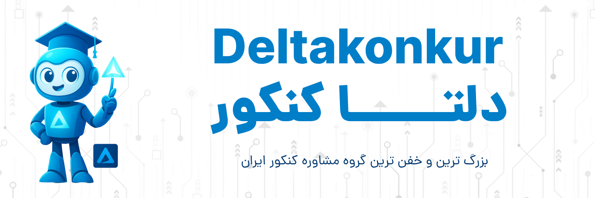

# DeltaKonkur - AI-Powered Educational Revolution 🚀

 

## Iran's First AI-Integrated Educational Consultancy Platform 

DeltaKonkur is pioneering Iran's educational transformation by merging cutting-edge artificial intelligence with academic consulting. As the nation's premier student support network, we're redefining how students prepare for the Konkur (National University Entrance Exam).

## 🌟 Why DeltaKonkur?

- **AI-Powered Personalization**: Tailored learning paths using intelligent algorithms
- **24/7 Virtual Mentors**: Always-available AI assistants for instant academic guidance
- **Data-Driven Strategies**: Smart analytics to optimize study efficiency
- **Next-Gen Resources**: Curated digital content for the modern learner

## Our Digital Ecosystem

🔗 **Official Website**: [www.deltakonkur.com](https://www.deltakonkur.com)  
📸 **Instagram**: [@deltakonkur](https://www.instagram.com/deltakonkur/?hl=fa)  
📢 **Telegram Channel**: [Join Now](https://t.me/+IbW1Idd9KFBhZWI8)  

## 🧠 Our Technological Edge

We're not just another educational platform - we're building the future with:
- Machine Learning models that adapt to each student's unique needs
- Natural Language Processing for intelligent Q&A systems
- Predictive analytics to forecast exam trends
- Automated progress tracking with smart recommendations

## Join the Educational Revolution

DeltaKonkur represents the perfect fusion of Persian educational expertise and Silicon Valley innovation. We're committed to democratizing access to quality education through technology.

*"Empowering Iran's students with AI - one genius at a time."*

---

📧 **Contact**: info@deltakonkur.com  
🏢 **Headquarters**: Hamadan, Iran | 🚀 Serving students nationwide
